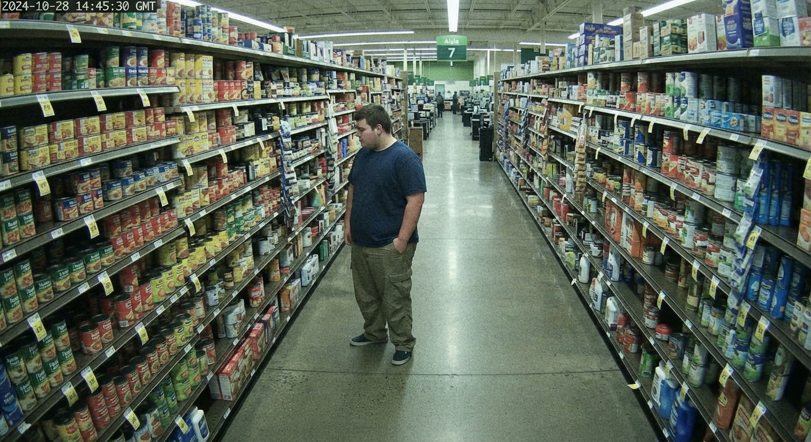
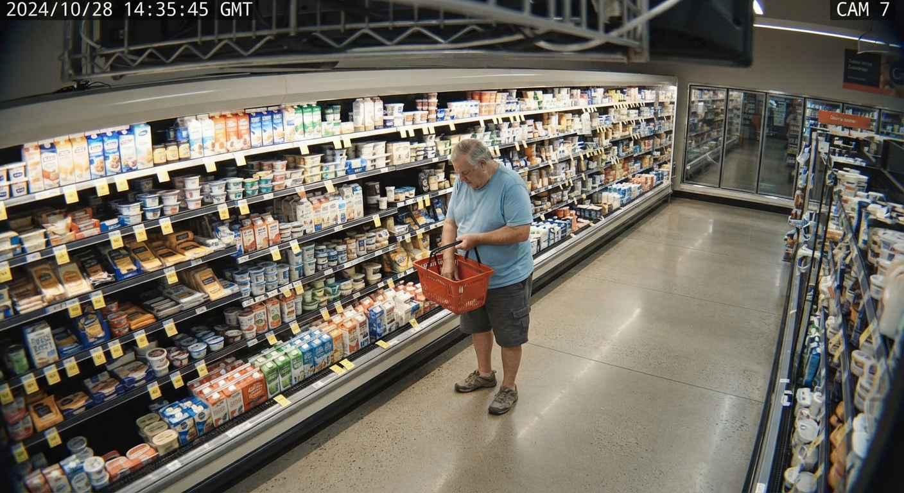
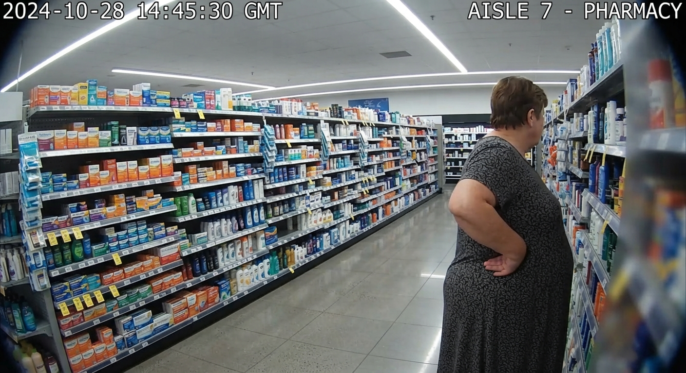
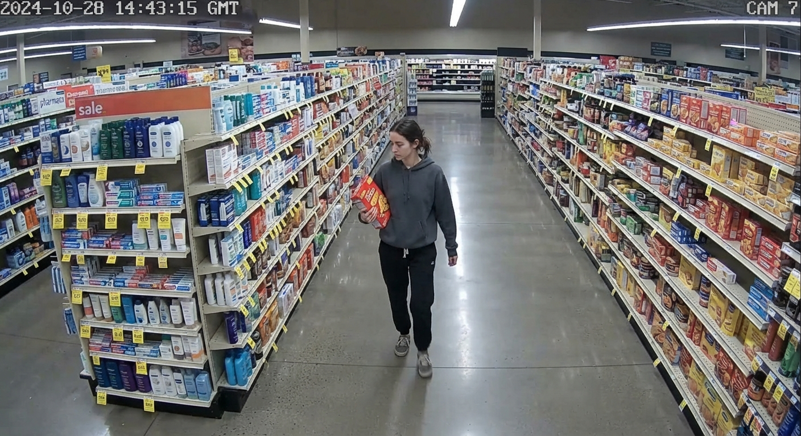
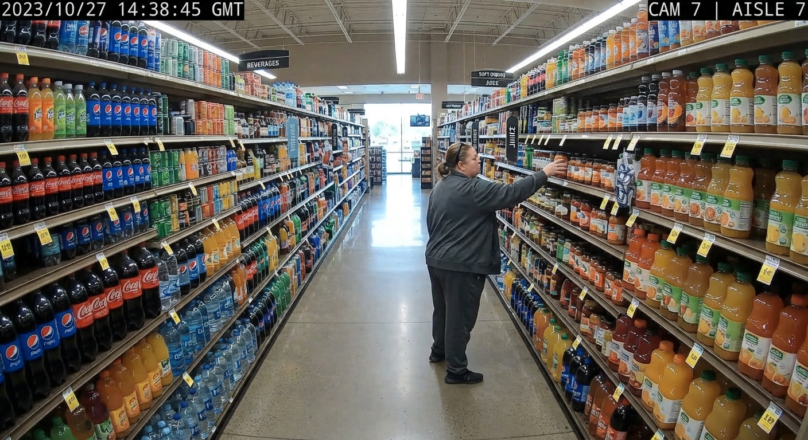
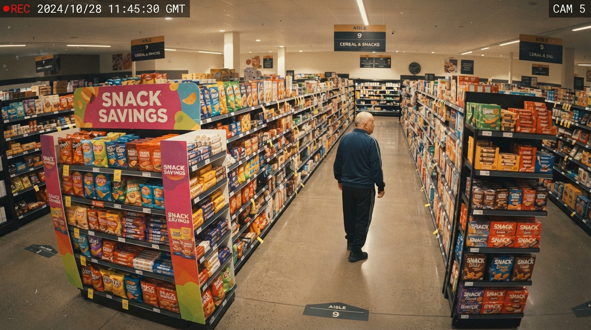
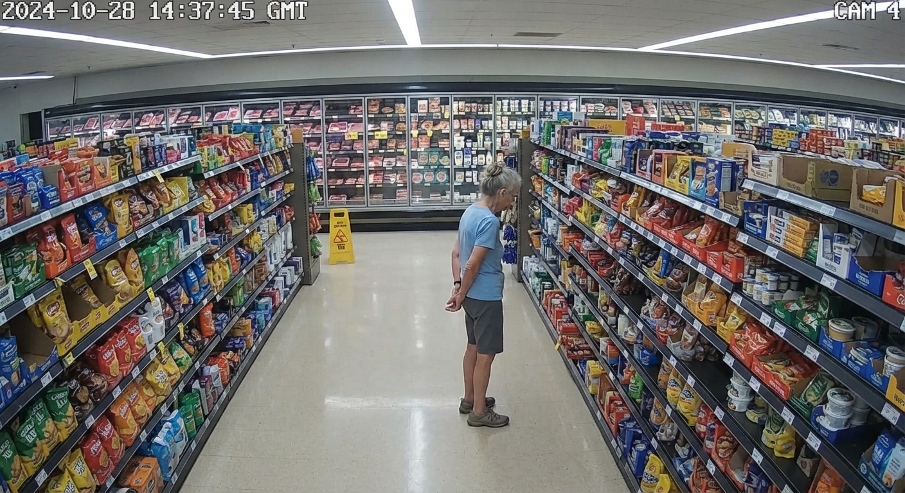
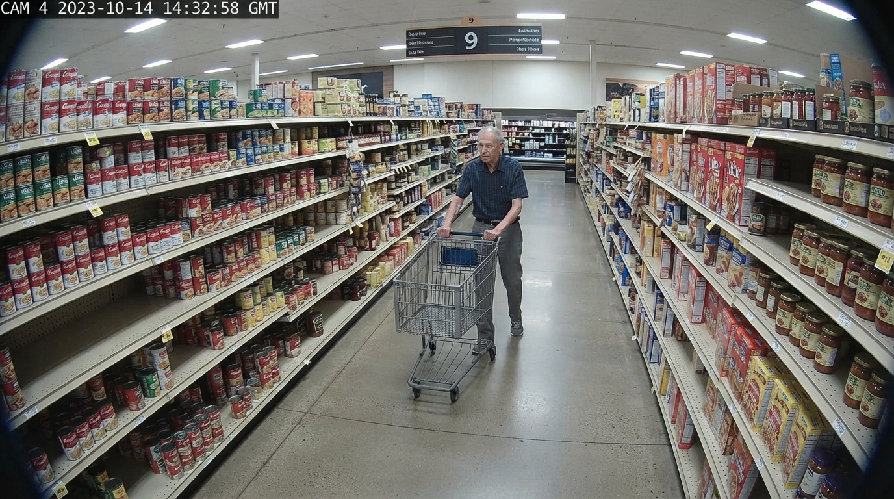

## Project Overview

SentinelFrame is a computer vision system for analyzing individual people detected in supermarket CCTV footage.

The objective is **not** to detect theft or identify shoplifters. Instead, the system classifies **observable hand states and interactions** for each detected person in every frame. These low-level observations can later be aggregated by a separate temporal module or risk engine to detect suspicious behavioral patterns.

The project focuses on building a robust **frame-level multi-label classifier** trained primarily on synthetic data.

---

# Pipeline

The complete inference pipeline is:

```
Video Frame / Photo
      │
      ▼
YOLO Person Detection (pretrained)
      │
      ▼
Person Bounding Box
      │
      ▼
Expand Bounding Box (≈30%)
      │
      ▼
Crop Person Region
      │
      ▼
Letterbox Resize
      │
      ▼
224×224 RGB Image
      │
      ▼
Frame-Level Multi-Label Classifier (LoRA-adapted foundation vision backbone)
      │
      ▼
Per-Person Labels + Confidence Scores
```

This pipeline is implemented twice: once as a batch job over a whole generated dataset (`preprocess_pipeline.ipynb`), and once as a single-image interactive demo that also draws the results back onto the image (`inference_dinov2.ipynb`). See [Notebooks](#notebooks) below.

---

# Input

The classifier receives a single cropped person image extracted from one CCTV frame.

Input preprocessing:

* Detect people using a pretrained YOLO model.
* Expand each bounding box by approximately 30% to preserve surrounding context (shopping bags, shelves, baskets, etc.).
* Crop the expanded region.
* Apply Letterbox resizing to a fixed 224×224 resolution while preserving the original aspect ratio.
* Feed the resulting RGB image into the classifier.

The classifier operates **independently on every frame**.

---

# Output

The model performs **multi-label classification**.

Each label is predicted independently using a sigmoid activation.

The output is a confidence score between 0 and 1 for every label.

Example:

```python
{
    "hand_in_pocket": 0.91,
    "hand_in_bag": 0.04,
    "hand_under_clothing": 0.01,
    "object_in_hand": 0.73,
    "interacting_with_shelf": 0.68,
    "hand_occluded_generic": 0.05,
    "both_hands_not_visible": 0.00,
    "no_visible_hand_interaction": 0.02
}
```

---

# Label Space

The classifier predicts the following observable states:

```python
LABELS = [
    "hand_in_pocket",
    "hand_in_bag",
    "hand_under_clothing",
    "object_in_hand",
    "interacting_with_shelf",
    "hand_occluded_generic",
    "both_hands_not_visible",
    "no_visible_hand_interaction",
]
```

This list is defined once, in `generate_images.py`, and is the single source of truth used by every script and notebook in the project.

## Label Definitions

### hand_in_pocket

At least one hand is clearly inside a pants, jacket, or coat pocket.



---

### hand_in_bag

At least one hand is inside a shopping bag, handbag, backpack, or other carried bag.



---

### hand_under_clothing

A hand is hidden underneath clothing, such as inside a jacket, hoodie, sweater, or shirt.



---

### object_in_hand

The person is visibly holding a product or object.



---

### interacting_with_shelf

The person is visibly reaching toward, touching, picking up, returning, or examining products on a supermarket shelf.



---

### hand_occluded_generic

A hand is not visible due to normal occlusion.

Examples include:

* hidden behind the person's body
* blocked by another customer
* occluded by shelves
* outside the camera field of view
* hidden by shopping carts or baskets

This label intentionally represents **non-suspicious visibility loss**.



---

### both_hands_not_visible

Neither hand is visible in the current frame.

This label is independent of the reason for the occlusion.



---

### no_visible_hand_interaction

Ordinary, unremarkable behavior: both hands are visible and doing nothing notable (walking normally, pushing a cart, holding a phone, carrying a basket by its handle). This is the "nothing to see here" class, included so the classifier has an explicit negative case rather than only ever seeing frames where *something* is happening with the hands.



---

# Model Characteristics

* Frame-level classification only
* Multi-label classification
* Sigmoid output layer, `BCEWithLogitsLoss` (with per-label `pos_weight`, since each label is positive in only a small minority of frames) during training
* Independent prediction for each label
* No temporal information is used by the classifier
* **Frozen pretrained vision backbone + LoRA adapters + a small trainable classification head** — not full fine-tuning. The backbone's LoRA target modules are discovered from the live model at runtime rather than hardcoded, since different backbones (CLIP, DINOv2, SigLIP, ...) name their attention/MLP projection layers differently.
* Baseline backbone: **OpenCLIP ViT-B/32**. Additional backbones (DINOv2, SigLIP, MobileNetV3, EfficientNetV2, ConvNeXt V2, and a from-scratch ResNet-18 baseline) are trained and compared under the identical protocol — see [Training Experiments](#training-experiments) below for the full experiment log and results table.

---

# Synthetic Dataset

The classifier is trained primarily on synthetic images generated with Google's Gemini image model (`generate_images.py`), rather than real CCTV footage.

Each generated image is built from a structured prompt template describing a realistic supermarket CCTV frame with exactly one isolated person. To avoid a repetitive, easy-to-overfit dataset, many aspects of every prompt are drawn independently at random for every image:

* subject age, body type, and clothing style
* which hand performs the action (left/right)
* camera position/angle, shelf arrangement, lighting, and surrounding product category
* a randomized CCTV "imperfection" (compression artifacts, sensor noise, motion blur, vignetting, etc.), so the model doesn't just learn to recognize a suspiciously clean synthetic image
* for `hand_under_clothing`, four structurally different concealment variants (under a jacket, under a shirt horizontally, under a shirt from the hem, both hands together)

Generation is:

* **Reproducible** — a `RANDOM_SEED` constant controls the entire sequence of random choices; the effective seed is always logged so any run can be replayed exactly.
* **Resumable** — a checkpoint file (`generation_progress.json`) tracks exactly which images have already succeeded, so a run that's interrupted (e.g. the API key runs out of credit) picks up where it left off on the next run instead of regenerating or losing anything. Round-robin generation across labels also means a partial run leaves progress spread evenly across labels rather than fully completing some and leaving others at zero.
* **Concurrent** — images are generated in parallel via a thread pool (`MAX_WORKERS` in `generate_images.py`), since each generation call is a slow, network-bound API request.
* **Traceable** — every generated image's exact prompt and randomized variable choices are recorded in `sample_metadata.json`, and a full run log (including failure reasons) is written to `{OUTPUT_DIR}/logs/`.

---

# Dataset & Pretrained Checkpoints

The generated image dataset (all labels), along with the trained DINOv2 checkpoint, is published on Hugging Face:

**https://huggingface.co/datasets/OriMaimon/SentinelFrame_Generated_Images/tree/main**

Use this if you want to skip synthetic data generation and training entirely and jump straight to running inference — download the DINOv2 checkpoint from there and use it directly with `inference_dinov2.ipynb`. Checkpoints for the other backbones compared in `finetune_openclip_lora.ipynb` (OpenCLIP, SigLIP, MobileNetV3, EfficientNetV2, ConvNeXt V2, ResNet-18) aren't published there — train them yourself via that notebook if needed.

---

# Project Structure

```
Generative_Models_Project/
├── README.md                       — this file
├── config.example.py               — config template (copy to config.py, see Setup)
├── config.py                       — your real API keys + OUTPUT_DIR (gitignored, never committed)
├── generate_images.py              — synthetic dataset generator (Gemini API)
├── test_generation_single_image.py — quick single-image prompt/generation testing script
├── preprocess_pipeline.ipynb       — YOLO detect → crop → letterbox, batch over a generated dataset
├── finetune_openclip_lora.ipynb    — LoRA fine-tuning + backbone comparison (training)
├── inference_dinov2.ipynb          — single-image / multi-person interactive inference demo
└── Data_Images/                    — generated dataset output (gitignored; see config.py's OUTPUT_DIR)
```

---

# Setup

## 1. Install dependencies

The generation scripts only need the Gemini SDK:

```bash
pip install google-genai
```

(`test_generation_single_image.py` can optionally also use OpenAI's image API — see that script's `MODEL_PROVIDER` setting — in which case also `pip install openai`.)

The notebooks install their own heavier dependencies (`ultralytics`, `torch`, `open_clip_torch`, `peft`, etc.) in their first cell — see [Notebooks](#notebooks) below.

## 2. Configure API keys

**Step 1 — create `config.py` from the template:**

```bash
cp config.example.py config.py
```

**Step 2 — add your API key(s) to `config.py`:**

- Google (required): get a key at https://aistudio.google.com/app/apikey and set `GOOGLE_API_KEY`.
- OpenAI (optional, only for `test_generation_single_image.py`'s OpenAI path): get a key at https://platform.openai.com/account/api-keys and set `OPENAI_API_KEY`.

**Step 3 — verify `config.py` is gitignored** (it already is, but worth double-checking before your first commit):

```bash
grep "config.py" .gitignore
# Should output: config.py
```

`config.py` is never committed — only `config.example.py` (the template, with placeholder values) is tracked in git.

## 3. Generate a synthetic dataset

Edit the top of `generate_images.py` to choose which labels and how many images per label to generate (`IMAGES_PER_LABEL`), then run:

```bash
python generate_images.py
```

Output (paths relative to `config.py`'s `OUTPUT_DIR`, default `Data_Images/`):

- Images: `{OUTPUT_DIR}/{label}/sample_NNN.png`
- Metadata (prompt + randomized variables per image): `{OUTPUT_DIR}/sample_metadata.json`
- Run logs: `{OUTPUT_DIR}/logs/`
- Resume checkpoint: `{OUTPUT_DIR}/generation_progress.json`

Re-running the script with the same `RANDOM_SEED` and `IMAGES_PER_LABEL` resumes automatically instead of duplicating work.

## 4. Test a single prompt

```bash
python test_generation_single_image.py
```

Edit these settings in the script:
- `MODEL_PROVIDER`: `"openai"` or `"google"`
- `LABEL`: which label to test
- `PROMPT`: the image generation prompt

Useful for quickly iterating on prompt wording before committing to a full generation run.

## 5. Package the dataset for the notebooks

The preprocessing/training notebooks expect a `.tar.gz` archive of the output directory:

```bash
tar -czf Data_Images.tar.gz Data_Images/
```

---

# Notebooks

All three notebooks are **plain Jupyter notebooks** — they were developed and tested on Google Colab, but nothing about them is Colab-specific beyond an optional `google.colab` import guard for the file-upload UI (each falls back to a plain local file path when that import isn't available). They run equally well on Jupyter/JupyterLab locally, VS Code's notebook support, or any other standard Jupyter environment — just install each notebook's first-cell dependencies and run top to bottom.

## `preprocess_pipeline.ipynb`

Takes the `Data_Images.tar.gz` archive produced by `generate_images.py`, extracts it, and runs every image through the YOLO detect → expand box → crop → letterbox pipeline described above, writing 224×224 crops to a new output directory organized the same way as the input (one sub-directory per label). Produces a `processing_report.json` recording, per label, how many images were successfully processed versus skipped (and why — no person detected, or a degenerate crop) — so nothing fails silently.

## `finetune_openclip_lora.ipynb`

Takes the preprocessed 224×224 crops and trains the multi-label classifier:

1. Builds a leakage-safe, stratified train/val/test split (splits are saved to `splits.json` for reproducibility).
2. Loads a pretrained vision backbone (OpenCLIP ViT-B/32 by default), freezes it, and injects LoRA adapters.
3. Replaces the classification head with a small MLP → 8 sigmoid outputs.
4. Trains with `BCEWithLogitsLoss` (class-imbalance-corrected via `pos_weight`), checkpointing the best model by validation macro-F1 after every epoch (`best_model.pt`, plus a running `training_history.json`) so a long run isn't lost if interrupted.
5. Evaluates on the held-out test set.
6. A later section (`10. Model comparison`) repeats the same protocol — same data, head, loss, optimizer, epoch count — for five additional backbones (DINOv2, SigLIP, MobileNetV3, EfficientNetV2, ConvNeXt V2) plus a from-scratch ResNet-18 baseline, so results are directly comparable across architectures. Each writes its own `best_model_<name>.pt` / `test_results_<name>.json` / `training_history_<name>.json` under `checkpoints/`, so nothing clashes.

See [Training Experiments](#training-experiments) below for the full experiment log (dataset sizes, augmentation strategy, and metrics for every run so far).

## `inference_dinov2.ipynb`

An interactive, single-image demo of the fully trained pipeline. Upload one photo and a trained checkpoint (e.g. `best_model_dinov2.pt`), and it walks through — and displays — every step individually: raw image → YOLO detection → expanded box → crop → letterbox → classifier output (per-label logits, sigmoid probabilities, and the final thresholded answer). It also includes a multi-person mode: it detects and classifies *every* person in the image at once, drawing a green box and predicted label on each (with an option to automatically hide any pair of people whose boxes overlap, since the classifier was only ever trained on isolated, unoccluded crops and its output on an overlapping pair can't be trusted).

---

# Training Experiments

All experiments below were run via `finetune_openclip_lora.ipynb`, using **OpenCLIP ViT-B/32** as the backbone unless noted otherwise.

## Experiment 1 – Original Synthetic Dataset

As an initial proof of concept, a small synthetic dataset was generated:

- **20 images per label**, **160 total**
- Generation cost: approximately **₪20**

This initial dataset was used to validate the complete training pipeline before scaling up.

Dataset split: **112** train / **24** val / **24** test.

Training configuration: **100 epochs**.

Best checkpoint:

```
Loaded best checkpoint from epoch 20
(val_f1_macro = 0.4786)
```

### Test Results

| Metric | Value |
|---------|------:|
| Precision (Macro) | **0.6771** |
| Recall (Macro) | **0.5000** |
| F1 (Macro) | **0.5405** |
| mAP (Macro) | **0.7424** |
| Subset Accuracy | **0.4167** |
| Loss | **0.8835** |

---

## Experiment 2 – Data Augmentation

To increase dataset diversity, several augmentations were applied **only to the training set**: Gaussian noise, random rotations, and additional perturbations.

An important design decision was to perform **all augmentations before the preprocessing pipeline** — every augmented image is treated as a new raw CCTV image, so the same preprocessing pipeline handles original and augmented images identically.

Dataset split: **448** train / **24** val / **24** test (496 total).

Training configuration: **100 epochs**.

Best checkpoint:

```
Loaded best checkpoint from epoch 5
(val_f1_macro = 0.5393)
```

### Test Results

| Metric | Value |
|---------|------:|
| Precision (Macro) | **0.3812** |
| Recall (Macro) | **0.5833** |
| F1 (Macro) | **0.4477** |
| mAP (Macro) | **0.6549** |
| Subset Accuracy | **0.2083** |
| Loss | **0.8948** |

Although the training set became significantly larger, this augmentation strategy alone did not improve generalization.

---

## Experiment 3 – Larger Synthetic Dataset + More Augmentations

The number of generated synthetic images was doubled, and the augmentation pipeline was expanded to produce **five augmented versions** of each training image.

Dataset split: **448** train / **24** val / **24** test (496 total).

Training configuration: **100 epochs**.

Best checkpoint:

```
Loaded best checkpoint from epoch 16
(val_f1_macro = 0.8783)
```

### Test Results

| Metric | Value |
|---------|------:|
| Precision (Macro) | **0.8214** |
| Recall (Macro) | **0.7917** |
| F1 (Macro) | **0.8002** |
| mAP (Macro) | **0.8568** |
| Subset Accuracy | **0.7500** |
| Loss | **0.9869** |

The combination of a larger synthetic dataset and increased augmentation diversity significantly improved generalization over Experiments 1 and 2 — a substantial jump in every metric, most notably F1 (macro) from 0.54 to 0.80.

---

## Current Status

Experiments 1–3 above establish that foundation vision models (OpenCLIP ViT-B/32 with a frozen backbone + LoRA) are highly effective for this task, and that dataset scale + augmentation diversity matter more than raw augmentation volume alone.

The planned next step — comparing additional backbone architectures (DINOv2, SigLIP, MobileNetV3, EfficientNetV2, ConvNeXt V2, and a from-scratch ResNet-18 baseline) under the identical protocol — is now implemented as section 10 of `finetune_openclip_lora.ipynb`. A DINOv2 checkpoint trained this way is already published (see [Dataset & Pretrained Checkpoints](#dataset--pretrained-checkpoints)); full comparative results across all backbones will be added here as those runs complete.

---

# Future Extensions

The current project intentionally performs only frame-level reasoning.

Future modules may include:

* person tracking
* temporal aggregation
* risk scoring
* event detection
* suspicious behavior recognition
* real-time deployment

These components are intentionally separated from the classifier so that the classifier remains responsible only for estimating observable visual states.
README.md
